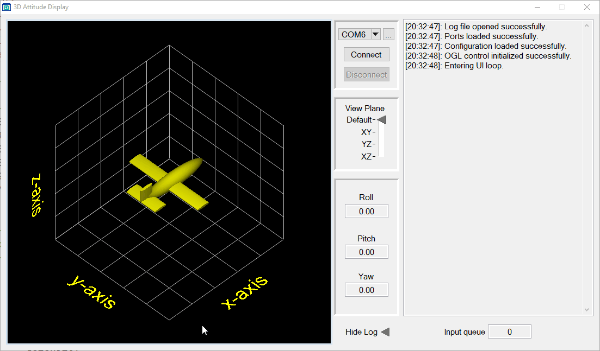

3D attitude display of aircraft, visualizing pitch, roll, and yaw in real-time using OpenGL.

## Features

- Real-time 3D visualization of aircraft/spacecraft attitude
- COM port communication for data input
- Configurable connection settings
- Logging functionality
- User-friendly interface with adjustable views

## Requirements

- LabWindows/CVI
- OpenGL libraries
- RS-232 compatible device for data input

## Usage

1. Select the appropriate COM port from the dropdown menu.
2. Click "Connect" to establish a connection with the data source.
3. The 3D model will update in real-time based on the incoming attitude data.
4. Use the "View Plane" control to change the perspective of the 3D model.
5. Access the log for detailed operation information.

## Configuration

You can modify connection parameters such as baud rate, parity, data bits, and stop bits in the configuration panel.

## Logging

The application logs all significant events and data to both the UI and a text file for later review.
